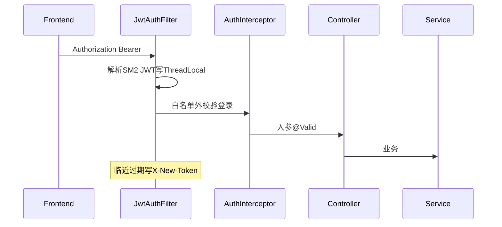
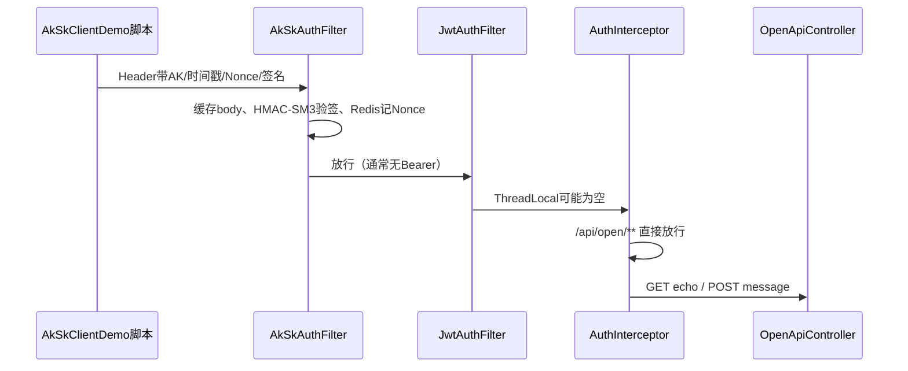

# 后端功能说明（学习导读）

面向前端同学对照代码学习。根目录 [README.md](../README.md) 负责启动；本文负责「功能在哪、请求怎么走」。

## 1. 包目录一览

源码根目录：`src/main/java/com/demo/`

| 功能 | 目录 / 类 | 说明 |
| --- | --- | --- |
| 启动入口 | `BackendApplication` | Spring Boot 启动类 |
| 注册登录 / 验证码 | `auth/` | Controller + CaptchaService + 入参 DTO |
| 用户分页 / 批量删除 | `user/` | Controller / Service / Mapper / Entity / VO |
| JWT 签发解析续期 | `jwt/JwtUtil` | 国密 SM2 签名的自研 JWT |
| 过滤器 / 拦截器 / 当前用户 | `security/` | Filter、Interceptor、ThreadLocal、LoginUser |
| 统一返回 / 异常 / AOP | `common/` | ApiResult、BizException、全局异常、操作日志 |
| 配置与 Bean | `config/` | WebMvc、JWT、验证码、密码、MyBatis-Plus |
| 健康检查 | `web/HealthController` | `/api/health`，顺带 ping Redis |
| 开放 API / AK/SK | `aksk/` | HMAC-SM3 验签 Filter + GET/POST 示例 + 客户端 Demo（**第 6 节专练**） |
| 库表迁移 | `resources/db/migration/` | Flyway：`V1` 占位，`V2` 建 `sys_user` |
| 运行配置 | `resources/application.yml` | 数据源、Redis、JWT、验证码、AK/SK |

## 2. 一次请求怎么走



文字版：

1. **Filter（最早）** `JwtAuthFilter`：从 `Authorization: Bearer ...` 取 token，SM2 验签后把用户放进 `SecurityUtils`（ThreadLocal）；快过期则响应头带 `X-New-Token`。
2. **Filter** `AkSkAuthFilter`：仅 `/api/open/**`，校验 `X-Access-Key` / 时间戳 / Nonce / HMAC-SM3 签名。
3. **Interceptor** `AuthInterceptor`：白名单与 `/api/open/**` 直接放行；其它接口若 ThreadLocal 没有用户，返回「未登录」。
4. **Controller**：`@Valid` / `@Validated` 校验入参，调用 Service。
5. **Service / Mapper**：业务逻辑 + MyBatis-Plus 访问 `sys_user`。
6. **异常**：业务抛 `BizException`，参数错误由校验异常，最终都进 `GlobalExceptionHandler`，统一成 `ApiResult`。
7. **AOP**：方法上有 `@OperLog` 时，`OperLogAspect` 打操作日志（谁、做什么、耗时）。

对比前端直觉：

| 后端概念 | 前端可类比 |
| --- | --- |
| Filter | axios 请求拦截器（更靠前，所有请求先过） |
| Interceptor | 路由守卫（决定能不能进页面） |
| ThreadLocal + SecurityUtils | 类似 pinia 里的 currentUser，但只在一次请求线程内有效 |
| `@Valid` DTO | 表单校验规则写在入参类上 |
| AOP `@OperLog` | 装饰器 / 高阶函数包一层打日志 |

## 3. 接口清单

### 公开（无需登录）

| 方法 | 路径 | 类.方法 |
| --- | --- | --- |
| GET | `/api/health` | `HealthController.health` |
| GET | `/api/auth/public-key` | `AuthController.publicKey` |
| GET | `/api/auth/captcha` | `AuthController.captcha` |
| POST | `/api/auth/register` | `AuthController.register` |
| POST | `/api/auth/login` | `AuthController.login` |

### 开放 API（Header：AK/SK + 国密 HMAC-SM3，无需 JWT）

| 方法 | 路径 | 类.方法 |
| --- | --- | --- |
| GET | `/api/open/echo?name=` | `OpenApiController.echo` |
| POST | `/api/open/message` | `OpenApiController.message` |

签名规则、动手步骤见下文 **第 6 节**；概念见 [ak和sk.md](ak和sk.md)；仓库根目录联调命令见 [README.md](../README.md) 第 4 节。

### 需登录（Header：`Authorization: Bearer <token>`）

| 方法 | 路径 | 类.方法 |
| --- | --- | --- |
| GET | `/api/auth/me` | `AuthController.me` |
| GET | `/api/users?page=&size=&username=` | `UserController.page` |
| DELETE | `/api/users/batch` | `UserController.batchDelete` |

用户数据表：`demo.sys_user`（密码是 BCrypt 密文；`deleted=1` 表示逻辑删除）。

登录/注册时 HTTP 里的 `password` 是 **SM2 公钥加密后的 hex**，不是明文。后端解密后再 BCrypt。这不能替代 HTTPS，只是 HTTP Demo 下的传输保护。

## 4. 建议阅读顺序

按这个顺序打开类（类上已有中文注释）：

1. `BackendApplication` — 入口  
2. `auth/AuthController` — 接口长什么样  
3. `auth/CaptchaService` — Redis 存验证码  
4. `user/UserService` — 注册加密、登录校验、分页删除  
5. `jwt/JwtUtil` — SM2 JWT 怎么造、怎么验、何时续期  
6. `security/JwtAuthFilter` — Filter 写 ThreadLocal  
7. `security/AuthInterceptor` — 白名单与强制登录  
8. `security/SecurityUtils` — 业务里如何取当前用户  
9. `common/OperLogAspect` — AOP 切面  
10. `common/GlobalExceptionHandler` — 异常如何变成统一 JSON  
11. 开放 API 专练：按 **第 6 节** 的阅读顺序学 `aksk/`  

## 5. 配置速查

见 `src/main/resources/application.yml`：

- `spring.datasource.*` → MySQL  
- `spring.data.redis.*` → Redis（Redisson 自动接）  
- `jwt.*` → SM2 公私钥 hex、过期时间、续期阈值  
- `captcha.*` → 图形验证码尺寸与 TTL  
- `aksk.*` → 开放 API 时间窗与 AK/SK 客户端列表  

## 6. AK/SK 开放 API 学习专练（给前端同学）

这套练习和「登录 JWT」是**两条正交鉴权链**，不要混在一起想。

| | 登录体系（你已经用过） | 开放 API（本练习） |
| --- | --- | --- |
| 谁调用 | 浏览器里的 Vue 前端 | 另一个服务 / 脚本 / 开放平台客户 |
| 身份凭证 | `Authorization: Bearer <JWT>` | `X-Access-Key` + 签名（**SK 永不上传**） |
| 国密算法 | SM2 签 JWT、加密密码 | HMAC-SM3 签整次请求 |
| 入口路径 | `/api/auth/*`、`/api/users` | `/api/open/*` |
| 前端类比 | 登录后把 token 塞进 axios 拦截器 | 更像调用云厂商 API：每次请求现场算签名 |

### 6.1 先建立心智模型（1 分钟）

```text
调用方手里有一对钥匙：
  AK = 公开身份（类似「我是谁」）
  SK = 保密密钥（类似「证明我是我」的笔）

每次请求：
  1. 把 method / path / query / 时间戳 / nonce / body摘要 拼成 stringToSign
  2. 用 SK 做 HMAC-SM3，得到 signature
  3. 只把 AK + 时间戳 + nonce + signature 放进 Header（SK 不发送）
服务端：
  用 AK 查出 SK → 用同样规则重算签名 → 比对；再查时间窗与 nonce 防重放
```

对照前端：JWT 是「登录一次，后续带票」；AK/SK 是「每次请求当场签字」。浏览器前端**一般不要**把 SK 写进前端代码（会泄露）；本 Demo 用 Java 客户端脚本模拟「服务端对服务端」调用。

### 6.2 一次开放 API 请求怎么走



要点（对应代码里的注释）：

1. **`CachedBodyHttpServletRequest`**：HTTP body 流只能读一次；Filter 要算 body 的 SM3，必须先缓存，再交给 Controller 的 `@RequestBody`。前端类比：你不能把 `ReadableStream` 消费两次，得先 `arrayBuffer()` 存住。
2. **`AkSkAuthFilter`**：只拦 `/api/open/**`，失败直接写 `ApiResult`，进不了 Controller。
3. **`AuthInterceptor`**：对 `/api/open/**` 放行，避免「没 JWT 就未登录」误伤开放接口。
4. **`OpenApiController`**：业务很薄，只演示 GET 查询参数 / POST JSON；真正的「难」在签名约定。

### 6.3 建议阅读顺序（按这个点文件）

类上已按前端视角写了中文注释，建议打开顺序：

1. [ak和sk.md](ak和sk.md) — 概念：为什么需要签名、防篡改/防重放  
2. `aksk/AkSkProperties` — 配置从哪来（对照 `application.yml` 的 `aksk`）  
3. `aksk/AkSkSigner` — **核心**：如何拼 `stringToSign`、如何 HMAC-SM3  
4. `aksk/AkSkClientDemo` — **先看客户端**：一次请求 Header 怎么带（最接近你写 axios 拦截器的感觉）  
5. `aksk/CachedBodyHttpServletRequest` — 为什么要缓存 body  
6. `aksk/AkSkAuthFilter` — 服务端验签 + 时间窗 + Redis Nonce  
7. `aksk/OpenApiController` — GET / POST 业务入口  
8. `security/AuthInterceptor` — 为何开放 API 不用 JWT 白名单以外的登录校验  

### 6.4 动手练习（边跑边看）

前提：MySQL / Redis 已起，后端已 `spring-boot:run`。

```bash
# 在仓库根目录
./scripts/aksk-demo.sh
```

成功时你会看到：打印的 `stringToSign`、`signature`，以及 `code:0` 的 JSON（含 `client: demo-client`）。

建议自己改一处再跑，观察失败信息（加深理解）：

| 故意搞坏 | 预期 |
| --- | --- |
| 改 Header 里的 signature 一个字符 | `签名校验失败` |
| 把 `X-Timestamp` 改成很久以前 | `请求已过期或时间偏差过大` |
| 同一组 Nonce 连发两次 | 第二次 `Nonce 已使用，疑似重放` |
| 去掉全部 AK/SK Header | `缺少 AK/SK 鉴权头` |
| 用错误的 AccessKey | `无效的 AccessKey` |

### 6.5 和前端 axios 的对应关系（便于迁移理解）

若将来你在**服务端 Node/Java** 里调别人的开放 API，拦截器大致是：

```text
axios 请求拦截器里：
  timestamp = now
  nonce = uuid
  stringToSign = 按约定拼接
  signature = HMAC_SM3(sk, stringToSign)
  headers['X-Access-Key'] = ak
  headers['X-Timestamp'] = timestamp
  headers['X-Nonce'] = nonce
  headers['X-Signature'] = signature
```

本仓库的「拦截器」实现就是 `AkSkClientDemo.call(...)`；服务端对应物是 `AkSkAuthFilter.verify(...)`。两边必须用**同一套** `AkSkSigner` 规则，差一个换行或 query 排序都会验签失败。
