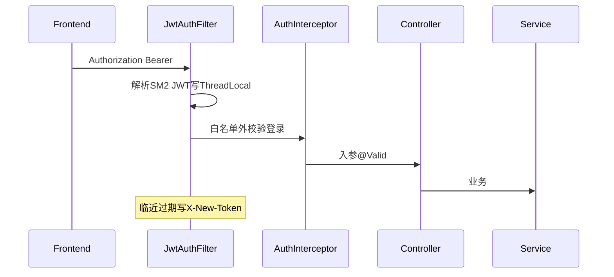

# 后端功能说明（学习导读）

面向前端同学对照代码学习。根目录 [README.md](../README.md) 负责启动；本文负责「功能在哪、请求怎么走」。

## 1. 包目录一览

源码根目录：`src/main/java/com/demo/`

| 功能 | 目录 / 类 | 说明 |
| --- | --- | --- |
| 启动入口 | `BackendApplication` | Spring Boot 启动类 |
| 注册登录 / 验证码 | `auth/` | Controller + CaptchaService + 入参 DTO |
| 用户分页 / 批量删除 | `user/` | Controller / Service / Mapper / Entity / VO |
| JWT 签发解析续期 | `jwt/JwtUtil` | 国密 SM2 签名的自研 JWT |
| 过滤器 / 拦截器 / 当前用户 | `security/` | Filter、Interceptor、ThreadLocal、LoginUser |
| 统一返回 / 异常 / AOP | `common/` | ApiResult、BizException、全局异常、操作日志 |
| 配置与 Bean | `config/` | WebMvc、JWT、验证码、密码、MyBatis-Plus |
| 健康检查 | `web/HealthController` | `/api/health`，顺带 ping Redis |
| 开放 API / AK/SK | `aksk/` | HMAC-SM3 验签 Filter + GET/POST 示例 + 客户端 Demo |
| 库表迁移 | `resources/db/migration/` | Flyway：`V1` 占位，`V2` 建 `sys_user` |
| 运行配置 | `resources/application.yml` | 数据源、Redis、JWT、验证码、AK/SK |

## 2. 一次请求怎么走

文字版：

1. **Filter（最早）** `JwtAuthFilter`：从 `Authorization: Bearer ...` 取 token，SM2 验签后把用户放进 `SecurityUtils`（ThreadLocal）；快过期则响应头带 `X-New-Token`。
2. **Filter** `AkSkAuthFilter`：仅 `/api/open/**`，校验 `X-Access-Key` / 时间戳 / Nonce / HMAC-SM3 签名。
3. **Interceptor** `AuthInterceptor`：白名单与 `/api/open/**` 直接放行；其它接口若 ThreadLocal 没有用户，返回「未登录」。
4. **Controller**：`@Valid` / `@Validated` 校验入参，调用 Service。
5. **Service / Mapper**：业务逻辑 + MyBatis-Plus 访问 `sys_user`。
6. **异常**：业务抛 `BizException`，参数错误由校验异常，最终都进 `GlobalExceptionHandler`，统一成 `ApiResult`。
7. **AOP**：方法上有 `@OperLog` 时，`OperLogAspect` 打操作日志（谁、做什么、耗时）。

对比前端直觉：

| 后端概念 | 前端可类比 |
| --- | --- |
| Filter | axios 请求拦截器（更靠前，所有请求先过） |
| Interceptor | 路由守卫（决定能不能进页面） |
| ThreadLocal + SecurityUtils | 类似 pinia 里的 currentUser，但只在一次请求线程内有效 |
| `@Valid` DTO | 表单校验规则写在入参类上 |
| AOP `@OperLog` | 装饰器 / 高阶函数包一层打日志 |

## 3. 接口清单

### 公开（无需登录）

| 方法 | 路径 | 类.方法 |
| --- | --- | --- |
| GET | `/api/health` | `HealthController.health` |
| GET | `/api/auth/public-key` | `AuthController.publicKey` |
| GET | `/api/auth/captcha` | `AuthController.captcha` |
| POST | `/api/auth/register` | `AuthController.register` |
| POST | `/api/auth/login` | `AuthController.login` |

### 开放 API（Header：AK/SK + 国密 HMAC-SM3，无需 JWT）

| 方法 | 路径 | 类.方法 |
| --- | --- | --- |
| GET | `/api/open/echo?name=` | `OpenApiController.echo` |
| POST | `/api/open/message` | `OpenApiController.message` |

签名规则与 Demo 调用方式见根目录 [README.md](../README.md) 第 4 节；概念见 [ak和sk.md](ak和sk.md)。

### 需登录（Header：`Authorization: Bearer <token>`）

| 方法 | 路径 | 类.方法 |
| --- | --- | --- |
| GET | `/api/auth/me` | `AuthController.me` |
| GET | `/api/users?page=&size=&username=` | `UserController.page` |
| DELETE | `/api/users/batch` | `UserController.batchDelete` |

用户数据表：`demo.sys_user`（密码是 BCrypt 密文；`deleted=1` 表示逻辑删除）。

登录/注册时 HTTP 里的 `password` 是 **SM2 公钥加密后的 hex**，不是明文。后端解密后再 BCrypt。这不能替代 HTTPS，只是 HTTP Demo 下的传输保护。

## 4. 建议阅读顺序

按这个顺序打开类（类上已有中文注释）：

1. `BackendApplication` — 入口  
2. `auth/AuthController` — 接口长什么样  
3. `auth/CaptchaService` — Redis 存验证码  
4. `user/UserService` — 注册加密、登录校验、分页删除  
5. `jwt/JwtUtil` — SM2 JWT 怎么造、怎么验、何时续期  
6. `security/JwtAuthFilter` — Filter 写 ThreadLocal  
7. `security/AuthInterceptor` — 白名单与强制登录  
8. `security/SecurityUtils` — 业务里如何取当前用户  
9. `common/OperLogAspect` — AOP 切面  
10. `common/GlobalExceptionHandler` — 异常如何变成统一 JSON  
11. `aksk/AkSkSigner` + `AkSkAuthFilter` — 开放 API 国密签名  
12. `aksk/OpenApiController` — GET/POST 示例  

## 5. 配置速查

见 `src/main/resources/application.yml`：

- `spring.datasource.*` → MySQL  
- `spring.data.redis.*` → Redis（Redisson 自动接）  
- `jwt.*` → SM2 公私钥 hex、过期时间、续期阈值  
- `captcha.*` → 图形验证码尺寸与 TTL  
- `aksk.*` → 开放 API 时间窗与 AK/SK 客户端列表  
